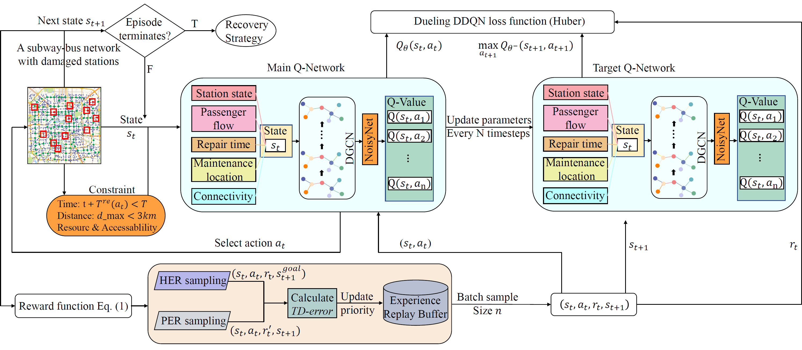

# 🚇🚌 Dynamic recovery sequence optimization of subway-bus network with constrained reinforcement learning

Shan Liu, Zhenhao Meng, Rui Jiang, Zhengli Wang, Ya Zhang*, Ying-En Ge*.

---

## 📦 Environment Setup

Make sure you have the following dependencies installed:

- Python >= 3.9  
- tensorflow==2.10
- numpy==1.26.4
- joblib==1.5.1
- pandas==2.3.0
- scikit-learn==1.7.0
- CUDA ≥ 11.2 (if using GPU)

Install dependencies with:

```bash
pip install -r requirements.txt
```


## 🧠 Overall Architecture
Framework of constrained reinforcement learning algorithm.



---
## 📚 Citation

If you find this repository helpful, please consider citing our work.  
The corresponding paper is currently under review and will be released soon.  

Citation information will be updated here once the paper is published.

---

## 📮 Contact

If you have questions, issues, or suggestions, feel free to reach out:

- **Email**: liushan22@seu.edu.cn  
